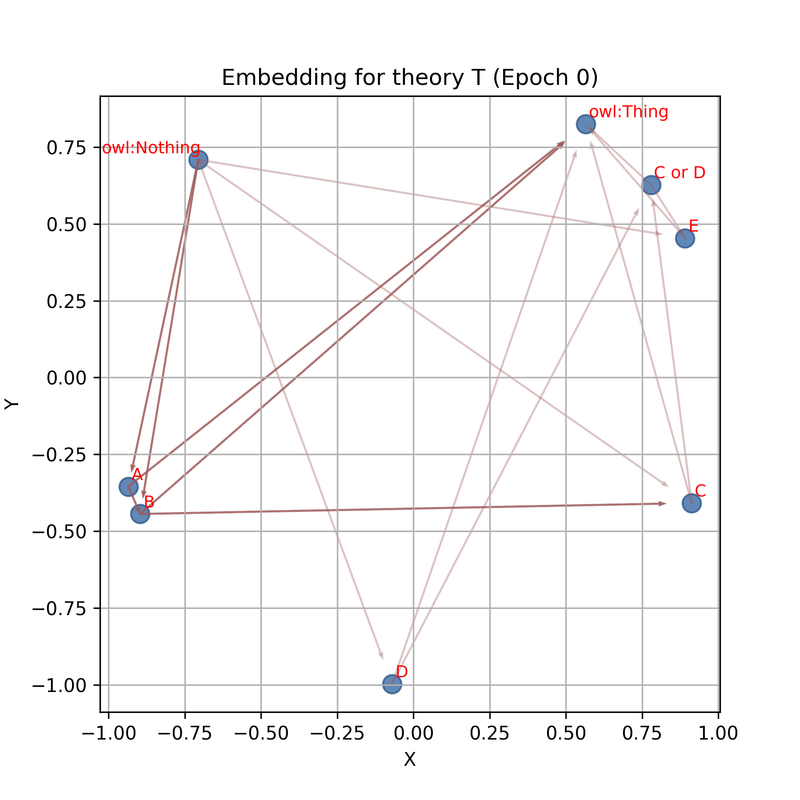
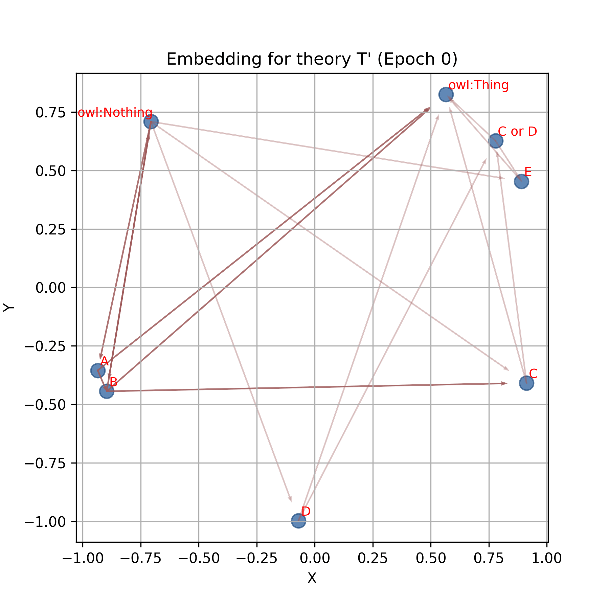

# CatE: Lattice preserving $\mathcal{ALC}$ ontology embeddings (with saturation)

This repository provides the code for papers:
- Lattice-preserving ALC ontology embeddings (NeSy 2024)
- Lattice-preserving ALC ontology embeddings with saturation (NAI Journal 2025)

### Dependencies

* Python >= 3.8
* mOWL

### Set up environment

```
cd catE
conda env create -f environment.yml
conda activate cate
```

## Getting the data

The data can be obtained from the following Zenodo repositories: 
- CatE original paper: https://zenodo.org/records/13766937
- CatE extended version: https://zenodo.org/records/15227489
After downloading, decompresss the file with the following command:

```
tar -xzvf use_cases.tar.gz # or tar -xzvf cate_exteded.tar.gz
```

I know, there is typo there :(

## Toy case

 Consider the theories: $T = \{A\sqsubseteq B, B \sqsubseteq C, C
  \sqcup D \sqsubseteq E\}$ and $T' = T \cup \\{B \sqsubseteq
  \bot \\}$. The example shows how the embeddings for theory $T$
  collapses on $A,B,\bot$, while the embeddings for theory $T'$ does
  not. This example shows how the embeddings can represent ontology
  semantics in terms of unsatisfiability of concepts.


<table>
  <tr>
    <!-- Titles -->
    <td align="center"><strong>Theory T</strong></td>
    <td align="center"><strong>Theory T'</strong></td>
  </tr>
  <tr>
    <!-- GIFs -->
    <td align="center"></td>
    <td align="center"></td>
  </tr>
</table>


## Running the model
 
* ORE1

```
run_cat_membership.py --batch_size=32768 --emb_dim=200 --loss_type=normal --lr=0.0001 --margin=1 --num_negs=4 --use_case=ore1

```
 
* GO

```
python run_cat_completion.py --batch_size=32768 --emb_dim=200 --loss_type=normal --lr=1e-05 --margin=1 --num_negs=2 --use_case=go -ns
```
 
* FoodOn

```
python run_cat_completion.py --batch_size=8192 --emb_dim=200 --loss_type=normal --lr=0.0001 --margin=1 --num_negs=2 --use_case=foodon -ns
```

* PPI

```
python run_cat_ppi.py --batch_size=65536 --emb_dim=200 --loss_type=normal --lr=0.0001 --margin=0.1 --num_negs=2 -ns
```

## Generating your own lattice

If you have an OWL file, you can generate the lattice running the following commands:
```
cd src/
python cat_projector.py /path/to/your_ontology_file.owl
```
This will generate a file named `/path/to/your_ontology_file.edgelist`. 
You might want to filter some trivial morphisms such as $C \sqsubseteq \top$ or $\bot \sqsubseteq C$. If so, run:
```
python remove_obvious_morphisms.py /path/to/your_ontology_file.edgelist
```
This will generate a file named: `/path/to/your_ontology_file_filtered.edgelist`

### CatE in mOWL
Additionally, we have added the projection algorithm to [mOWL](https://github.com/bio-ontology-research-group/mowl). Please read the following [documentation](https://mowl.readthedocs.io/en/latest/graphs/projection.html)
   
## Citation
<details>
<summary>NeSy 2024 conference paper</summary>

```
@InProceedings{10.1007/978-3-031-71167-1_19,
author="Zhapa-Camacho, Fernando
and Hoehndorf, Robert",
editor="Besold, Tarek R.
and d'Avila Garcez, Artur
and Jimenez-Ruiz, Ernesto
and Confalonieri, Roberto
and Madhyastha, Pranava
and Wagner, Benedikt",
title="Lattice-Preserving {\$}{\$}{\backslash}mathcal {\{}ALC{\}}{\$}{\$}Ontology Embeddings",
booktitle="Neural-Symbolic Learning and Reasoning",
year="2024",
publisher="Springer Nature Switzerland",
address="Cham",
pages="355--369",
isbn="978-3-031-71167-1"
}
```
</details>

<details>
<summary>NAI Journal 2025 (extended version)</summary>

```
TODO
```
</details>
